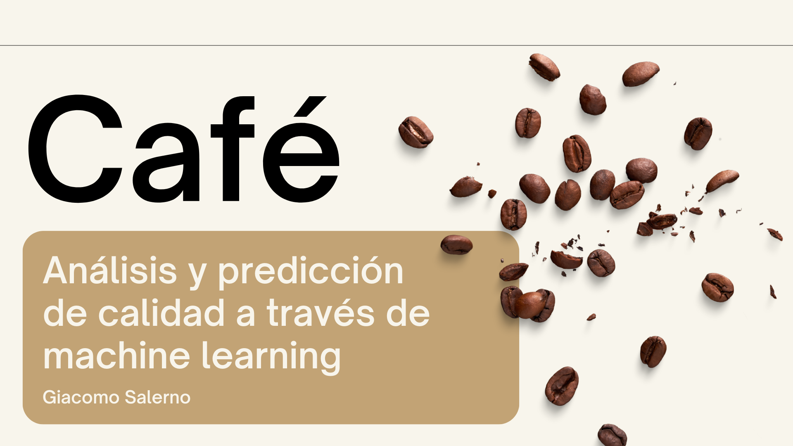

# Análisis y Predicción de Calidad del Café a Través de Machine Learning

Este repositorio contiene un modelo de Machine Learning diseñado para determinar la calidad del café en tres diferentes categorías: estándar, bueno y premium.

## Datos

Coffee Quality database from CQI  
Fuente: [Kaggle](https://www.kaggle.com/datasets/volpatto/coffee-quality-database-from-cqi)  
Fuente original: [Coffee Quality Institute](https://database.coffeeinstitute.org/)

##  Objetivos

Como se ha mencionado antes, el objetivo es determinar la calidad del café, que bien podría hacerse a través de sus propiedades organolépticas, pero, al ser una suma, no tendría sentido abordarlo con un modelo de machine learning, por lo que se plantea determinar la misma calidad del café a través de otras características como pueden ser su país de origen o procesado; o incluso abordar propiedades organolépticas que no están incluidas en la sumatoria del cálculo de calidad, como puede ser la humedad del grano o el color de la drupa. 

## Estructura del repositorio

El repositorio está organizado en las siguientes carpetas:

### 1. data
En esta carpeta se encuentran los datos utilizados en el proyecto en diferentes formas. Los datos se encuentran en su estado crudo, procesados y subdivididos en conjuntos de entrenamiento y prueba para facilitar las evaluaciones.

### 2. src
La carpeta `src` contiene los archivos ejecutables en formato `.py`. Estos archivos se utilizan para procesar los datos, definir el modelo y evaluar su rendimiento.

### 3. models
En la carpeta `models` se encuentran los modelos creados durante el desarrollo del proyecto. Además, se incluye un archivo `.yaml` que define los parámetros utilizados en los modelos.

### 4. notebooks
La carpeta `notebooks` contiene los archivos Jupyter Notebook utilizados para el análisis exploratorio y las pruebas preliminares en el desarrollo del modelo.

### 5. app
En la carpeta `app` se encuentra una aplicación de Streamlit que detalla los pasos del proyecto, desde el procesamiento de datos hasta la creación del modelo de Machine Learning. La aplicación también incluye una demostración del modelo seleccionado, donde es posible predecir la calidad de una muestra de café.

### 6. docs
La carpeta `docs` contiene una presentación de negocio que aborda el problema de manera resumida y destaca los beneficios del proyecto de Machine Learning.

## Conclusiones

Con el modelo creado podremos:

* Asegurarnos de que la calidad del café que vamos a comprar va a ser exactamente la que esperamos; sin sorpresas, sin disgustos.

* Ahorrar dinero, al asegurarnos de que no vamos a comprar un café de calidad estándar por el precio de un café de calidad premium.

* Comprar de manera sencilla; pues todas las variables que utiliza el modelo son de fácil acceso para el comprador, lo que también significa un ahorro de tiempo al no tener que solicitar muestras al proveedor.